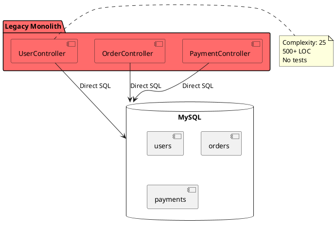
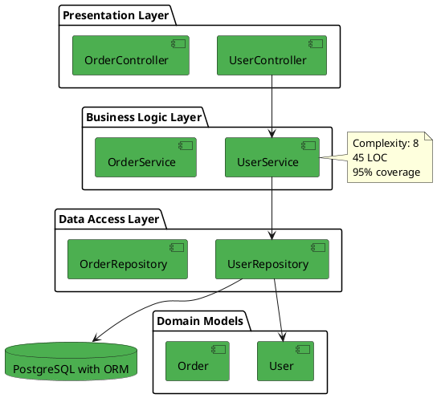

# 📖 Покрокова інструкція з використання шаблонів

Цей документ допоможе вам підготувати всі необхідні матеріали для захисту комплексного підсумкового завдання з Реінженерії ПЗ.

---

## 🎯 Що вам потрібно зробити?

### Крок 1: Підготувати код проекту ✅

**Що потрібно:**
- Ваш проект з попередніх лабораторних робіт
- Код "до" рефакторингу (зберігся в Git історії)
- Код "після" рефакторингу (поточна версія)

**Дії:**

1. **Створіть окремий branch для демонстрації "до":**
```bash
# Знайдіть коміт до початку рефакторингу
git log --oneline

# Створіть branch з цього коміту
git checkout -b legacy-version <commit-hash>
git push origin legacy-version

# Поверніться на main
git checkout main
```

2. **Переконайтесь, що в проекті є чітка структура:**
```
project/
├── src/              # Ваш код
├── tests/            # Ваші тести
├── docs/             # Документація (створите нижче)
├── .github/workflows # CI/CD (створите нижче)
└── README.md         # Головна інструкція
```

---

## 📋 Крок 2: Зібрати метрики якості коду

### 2.1 Цикломатична складність

**Для Python (використайте Radon або SonarQube):**
```bash
# Встановіть radon
pip install radon

# Для legacy версії
git checkout legacy-version
radon cc src/ -a -s

# Для модернізованої версії
git checkout main
radon cc src/ -a -s
```

**Для Java (використайте PMD або SonarQube):**
```bash
# Скористайтесь PMD або інтеграцією з IDE
```

**Для JavaScript (використайте ESLint з complexity plugin):**
```bash
npm install eslint eslint-plugin-complexity
eslint src/ --rule 'complexity: [error, 10]'
```

### 2.2 Test Coverage

**Для Python:**
```bash
pytest --cov=src --cov-report=html --cov-report=term
```

**Для Java:**
```bash
mvn clean test jacoco:report
```

**Для JavaScript:**
```bash
npm test -- --coverage
```

### 2.3 Technical Debt (через SonarQube)

```bash
# Запустіть локальний SonarQube
docker-compose --profile development up -d sonarqube

# Дочекайтеся старту (може зайняти 2-3 хв)
# Відкрийте http://localhost:9000 (admin/admin)

# Проаналізуйте legacy версію
git checkout legacy-version
sonar-scanner \
  -Dsonar.projectKey=myproject-legacy \
  -Dsonar.sources=src \
  -Dsonar.host.url=http://localhost:9000 \
  -Dsonar.login=admin \
  -Dsonar.password=admin

# Проаналізуйте модернізовану версію
git checkout main
sonar-scanner \
  -Dsonar.projectKey=myproject-modern \
  -Dsonar.sources=src \
  -Dsonar.host.url=http://localhost:9000 \
  -Dsonar.login=admin \
  -Dsonar.password=admin
```

### 2.4 Створіть таблицю метрик

Відкрийте шаблон `MODERNIZATION_REPORT.md` і заповніть таблицю:

```markdown
| Модуль/Компонент | Метрика | До | Після | Покращення |
|------------------|---------|-----|-------|------------|
| `UserService` | Cyclomatic Complexity | 25 | 8 | ↓ 68% |
| ... | ... | ... | ... | ... |
```

**Де взяти дані:**
- Cyclomatic Complexity: з Radon/PMD або SonarQube
- Test Coverage: з pytest-cov/JaCoCo/nyc
- Technical Debt Ratio: тільки з SonarQube
- Maintainability Index: з SonarQube або Visual Studio

---

## 🏗️ Крок 3: Створити діаграми архітектури

### 3.1 Діаграма "AS-IS" (як було)

**Інструменти:**
- [Draw.io](https://app.diagrams.net/) - безкоштовний онлайн редактор
- [Lucidchart](https://www.lucidchart.com/) - професійний інструмент
- [PlantUML](https://plantuml.com/) - діаграми з коду

**Що має бути на діаграмі:**
- Всі основні компоненти системи
- Зв'язки між ними (покажіть tight coupling)
- База даних
- Виділіть проблемні місця червоним

**Приклад PlantUML коду:**


Збережіть як `docs/diagrams/as-is.png`

### 3.2 Діаграма "TO-BE" (як стало)

**Що має бути на діаграмі:**
- Чітке розділення на шари (Layers)
- Стрілки показують напрямок залежностей
- Використання Repository Pattern
- Зелений колір для нових компонентів

**Приклад:**


Збережіть як `docs/diagrams/to-be.png`

---

## 📝 Крок 4: Написати ADR (Architectural Decision Record)

### 4.1 Оберіть найважливіше рішення

Приклади того, про що можна написати ADR:
- Впровадження ORM замість сирих SQL
- Розділення на шари (Layered Architecture)
- Виділення модуля в окремий сервіс
- Вибір конкретної бібліотеки/фреймворку
- Зміна підходу до тестування

### 4.2 Заповніть шаблон ADR

Відкрийте `ADR-001 шаблон` і заповніть:

1. **Контекст** - опишіть проблему своїми словами
2. **Рішення** - що ви вирішили зробити
3. **Альтернативи** - які варіанти розглядали
4. **Наслідки** - плюси і мінуси рішення
5. **Приклад коду** - обов'язково покажіть "до" і "після"

**Важливо:** ADR має бути реальним, базуватися на вашому коді!

Збережіть як `docs/ADR/ADR-001-[ваше-рішення].md`

---

## 🧪 Крок 5: Написати критичні тести

### 5.1 Оберіть 2-3 найважливіших функції

**Критерії важливості:**
- Бізнес-логіка (розрахунки, платежі)
- Безпека (автентифікація, валідація)
- Складна логіка (багато умов)

### 5.2 Напишіть Unit-тести

**Приклад для Python (pytest):**
```python
# tests/unit/test_payment_service.py

import pytest
from src.services.payment_service import PaymentService
from src.models.user import User
from src.models.order import Order
from src.exceptions import InsufficientFundsError

def test_process_payment_insufficient_funds():
    """
    КРИТИЧНИЙ ТЕСТ: система не повинна дозволяти оплату
    якщо недостатньо коштів на рахунку
    """
    # Arrange
    user = User(id=1, balance=50.0)
    order = Order(id=1, amount=100.0)
    service = PaymentService()
    
    # Act & Assert
    with pytest.raises(InsufficientFundsError):
        service.process_payment(user, order)
    
    # Переконуємось, що баланс не змінився
    assert user.balance == 50.0

def test_process_payment_success():
    """
    КРИТИЧНИЙ ТЕСТ: успішна оплата має знизити баланс
    """
    # Arrange
    user = User(id=1, balance=150.0)
    order = Order(id=1, amount=100.0)
    service = PaymentService()
    
    # Act
    result = service.process_payment(user, order)
    
    # Assert
    assert result.success is True
    assert user.balance == 50.0
    assert order.status == "paid"
```

### 5.3 Запустіть тести та збережіть результат

```bash
# Запустіть з coverage
pytest --cov=src --cov-report=html

# Зробіть скріншот або скопіюйте вивід
# Додайте в звіт
```

---

## 🚀 Крок 6: Налаштувати CI/CD

### 6.1 Створіть GitHub Actions workflow

Створіть файл `.github/workflows/ci.yml`:

```yaml
name: CI/CD

on:
  push:
    branches: [ main, develop ]
  pull_request:
    branches: [ main ]

jobs:
  test:
    runs-on: ubuntu-latest
    
    steps:
    - uses: actions/checkout@v3
    
    - name: Set up Python
      uses: actions/setup-python@v4
      with:
        python-version: '3.11'
    
    - name: Install dependencies
      run: |
        pip install -r requirements.txt
        pip install -r requirements-dev.txt
    
    - name: Lint with flake8
      run: |
        flake8 src/ --max-line-length=120
    
    - name: Run tests
      run: |
        pytest --cov=src --cov-report=xml --cov-report=term
    
    - name: Check coverage
      run: |
        coverage report --fail-under=80
```

### 6.2 Перевірте, що CI працює

```bash
# Зробіть коміт
git add .github/workflows/ci.yml
git commit -m "ci: add GitHub Actions workflow"
git push

# Перейдіть на GitHub → вкладка Actions
# Переконайтеся, що workflow запустився і пройшов успішно
```

---

## 🐳 Крок 7: Налаштувати Docker

### 7.1 Створіть Dockerfile

```dockerfile
FROM python:3.11-slim

WORKDIR /app

# Встановити системні залежності
RUN apt-get update && apt-get install -y \
    postgresql-client \
    && rm -rf /var/lib/apt/lists/*

# Встановити Python залежності
COPY requirements.txt .
RUN pip install --no-cache-dir -r requirements.txt

# Скопіювати код
COPY . .

# Змінні оточення
ENV PYTHONUNBUFFERED=1
ENV PYTHONDONTWRITEBYTECODE=1

EXPOSE 8000

CMD ["gunicorn", "config.wsgi:application", "--bind", "0.0.0.0:8000"]
```

### 7.2 Створіть .env.example

```bash
# Database
DB_HOST=db
DB_PORT=5432
DB_NAME=myapp_db
DB_USER=myapp_user
DB_PASSWORD=changeme_in_production

# Application
SECRET_KEY=your-secret-key-here
DEBUG=False
ALLOWED_HOSTS=localhost,127.0.0.1

# Redis
REDIS_URL=redis://redis:6379/0
REDIS_PASSWORD=changeme_in_production
```

### 7.3 Скопіюйте docker-compose.yml

Використайте шаблон `docker-compose.yml`, який я створив вище.

### 7.4 Перевірте, що Docker працює

```bash
# Створіть .env
cp .env.example .env

# Запустіть
docker-compose up -d

# Перевірте логи
docker-compose logs -f app

# Відкрийте http://localhost:8000
```

---

## 📄 Крок 8: Заповнити MODERNIZATION_REPORT.md

### 8.1 Executive Summary

Напишіть короткий опис (3-5 речень):
- Яку систему модернізували
- Які були основні проблеми
- Що зробили
- Які результати досягли

### 8.2 Заповніть всі таблиці

Використовуйте реальні дані, які ви зібрали у Кроці 2.

### 8.3 Додайте посилання на діаграми

```markdown


```

### 8.4 Вставте приклади коду

Візьміть реальні фрагменти з вашого проекту для секції "Hotspots".

---

## 🎤 Крок 9: Підготувати презентацію

### 9.1 Створіть презентацію

**Інструменти:**
- Google Slides (рекомендовано)
- PowerPoint
- Canva (для красивих слайдів)

**Структура (8-10 слайдів):**
1. Титульний слайд
2. Проблема (що боліло)
3. Найстрашніший код (до/після)
4. Рішення (що зробили)
5. Результат (метрики)
6. Діаграми архітектури
7. Демонстрація (опціонально)
8. План наступних кроків
9. Фінальний слайд

### 9.2 Використайте шаблон

Відкрийте `Структура презентації для захисту` - там є готові скрипти для кожного слайду.

### 9.3 Відрепетируйте виступ

```
✅ Репетиція 1: Прочитайте текст
✅ Репетиція 2: Скажіть своїми словами
✅ Репетиція 3: З таймером (7 хв максимум)
✅ Репетиція 4: Перед друзями/родиною
✅ Репетиція 5: Фінальна перед сном
```

**Поради:**
- Говоріть впевнено, навіть якщо хвилюєтесь
- Дивіться на викладача, а не в екран
- Використовуйте паузи для підсилення важливих моментів
- Посміхайтеся - ви молодець, що дійшли до цього етапу!

---

## 📦 Крок 10: Фінальна перевірка

### Checklist перед здачею:

#### Код
- [ ] Репозиторій на GitHub/GitLab
- [ ] Чітка історія комітів (Conventional Commits)
- [ ] Є branch `legacy-version` з кодом "до"
- [ ] Є branch `main` з кодом "після"
- [ ] README.md заповнений
- [ ] .gitignore налаштований

#### Документація
- [ ] MODERNIZATION_REPORT.md заповнений
- [ ] Всі метрики зібрані та занесені в таблиці
- [ ] Є діаграми AS-IS та TO-BE
- [ ] Є хоча б 1 ADR документ
- [ ] Є інструкція з розгортання

#### Тести
- [ ] Написано 2-3 критичних unit-тести
- [ ] Тести проходять успішно
- [ ] Coverage ≥ 80% (або близько до цього)
- [ ] Є опис піраміди тестування

#### CI/CD та DevOps
- [ ] GitHub Actions workflow налаштований
- [ ] CI проходить успішно (зелений)
- [ ] Docker Compose конфігурація є
- [ ] Можна запустити проект через `docker-compose up -d`

#### Презентація
- [ ] 8-10 слайдів готові
- [ ] Є порівняння коду "до/після"
- [ ] Є графік/діаграми з метриками
- [ ] Відрепетирували 5 разів
- [ ] Укладається в 5-7 хвилин

#### Додатково
- [ ] Підготували відповіді на можливі питання
- [ ] Ноутбук заряджений
- [ ] Є резервна копія всього (USB флешка)

---

## 🎯 Поради для успішного захисту

### Що робить сильне враження на викладача:

✨ **Реальні дані та метрики**
- "Складність знизилася з 25 до 8" краще за "код став простішим"

✨ **Візуальне порівняння**
- Покажіть код до/після поряд на одному слайді

✨ **Бізнес-цінність**
- "Час розробки фічі скоротився з 5 днів до 2"
- Говоріть мовою ROI

✨ **Впевненість**
- Ви експерт у своєму коді
- Ви зробили хорошу роботу
- Вірте в це!

✨ **Підготовка до питань**
- "Чому саме цей патерн?" → готова відповідь
- "Скільки часу зайняло?" → готова відповідь
- "Як переконаєте команду?" → готова відповідь

### Що НЕ варто робити:

❌ Виправдовуватися за недоробки
❌ Читати з слайдів
❌ Використовувати багато жаргону без пояснень
❌ Перевищувати ліміт часу
❌ Показувати невпевненість

---

## 📞 Допомога та підтримка

### Якщо щось не виходить:

1. **Проблеми з метриками:**
   - Спробуйте SonarQube - він дає всі метрики одразу
   - Якщо не вдається встановити - використайте онлайн інструменти

2. **Проблеми з Docker:**
   - Можна обійтися без Docker, якщо немає часу
   - Головне - показати розуміння концепції

3. **Проблеми з CI/CD:**
   - Мінімум - додайте workflow файл, навіть якщо він не працює
   - Поясніть на захисті, що планували зробити

4. **Мало часу:**
   - Зосередьтесь на найважливішому: метрики + код до/після
   - Решту можна спростити

### Пріоритети, якщо обмежені в часі:

**Високий пріоритет (must have):**
1. ✅ Метрики до/після
2. ✅ Приклад коду до/після
3. ✅ Робочі тести
4. ✅ MODERNIZATION_REPORT.md

**Середній пріоритет (should have):**
5. ✅ Діаграми архітектури
6. ✅ ADR документ
7. ✅ Презентація

**Низький пріоритет (nice to have):**
8. ⭕ Docker Compose
9. ⭕ CI/CD
10. ⭕ Monitoring (Grafana)

---

## 🎓 Фінальні напутні слова

Пам'ятайте:

1. **Ви вже багато зробили** - це завершальний акорд, не починайте з нуля
2. **Викладач на вашому боці** - він хоче, щоб ви здали
3. **Презентація важливіша за деталі** - вміння подати важливіше за досконалість
4. **Будьте собою** - щирість цінується більше за ідеальність
5. **Ви молодець** - те, що ви дочитали до сюди - вже 80% успіху!

---

**Успіхів на захисті! 🚀**

Якщо виникнуть питання - пишіть викладачу або одногрупникам. Разом легше!

---

**Автор інструкції:** Claude (Anthropic)  
**Дата:** 2024-12-06  
**Версія:** 1.0